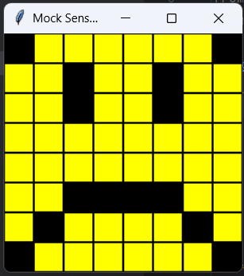
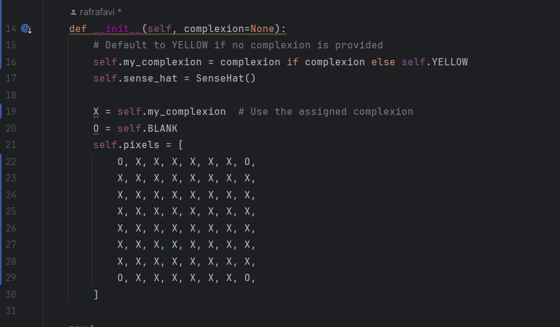

<style>

body {
    counter-reset: h2counter;
}

/* H1 - No numbering */
h1 {
    /* No counter reset or increment */
}

/* H2 - Level 1 numbering */
h2 {
    counter-reset: h3counter;
}

h2::before {
    counter-increment: h2counter;
    content: counter(h2counter) ". ";
}

/* H3 - Level 2 numbering */
h3 {
    counter-reset: h4counter;
}

h3::before {
    counter-increment: h3counter;
    content: counter(h2counter) "." counter(h3counter) " ";
}

/* H4 - Level 3 numbering (optional) */
h4 {
    counter-reset: h5counter;
}

h4::before {
    counter-increment: h4counter;
    content: counter(h2counter) "." counter(h3counter) "." counter(h4counter) " ";
}

</style>

# Evidence and Knowledge

This document includes instructions and knowledge questions that must be completed to receive a *Competent* grade on this portfolio task.

## Required evidence

### Answer all questions in this document

- Each answer should be complete, well-articulated, and within the specified word count limits (if added) for each question.
- Please make sure **all** external sources are properly cited.
- You must **use your own words**. Please include your full chat transcripts if you use generative AI in any way.
- Generative AI hallucinates, is not an authoritative source

### Make all the required modifications to the code

- Please follow the instructions in this document to make the changes needed to the code.

- When requested to upload evidence, upload all screenshots to `screenshots/` and embed them in this document. For example:

```markdown

```

- You must upload the code into your GitHub repository.
- While you can use a branch, your code should be in main when you submit.
- Upload a zip of this repository to Blackboard when you are ready to submit.
- You will be notified of your result via Blackboard
- However, if using GitHub classrooms, you may also receive additional feedback on GitHub directly

### Optional: Use of Raspberry Pi and SenseHat

Raspberry Pi or SenseHat is **optional** for this activity. You can use the included `sense_hat.py` file to simulate the SenseHat on your computer.

If you use a Pi, please **delete** the `sense_hat.py` file.

### Accessible version of the code

This project relies on visual patterns that appear on an LED matrix. If you have any accessibility requirements, you can use the `udl/accessible` branch to complete the project. This branch provides an accessible code version that uses text-based patterns instead of visual ones.

Please discuss this with your lecturer before using that branch.

## Specific Tasks & Questions

Address the following tasks and questions based on the code provided in this repository.

### Set up the project locally

1. Fork this repository (if not using GitHub Classrooms)
2. Clone your repository locally
3. Run the project locally by executing the `main.py` file
4. Evidence this by providing screenshots of the project directory structure and the output of the `main.py` file


If you are running on a Raspberry Pi, you can use the following command to run the project and then screenshot the result:

```bash
ls
python3 main.py
```

### Fundamental code comprehension
    
 Answer each of the following questions **as they relate to that code** supplied by in this repository (ignore `sense_hat.py`):

1. Examine the code for the `smiley.py` file and provide  an example of a variable of each of the following types and their corresponding values (`_` should be replaced with the appropriate values):

   | Type                    | name         | value                          |
   |-------------------------|--------------|--------------------------------|
   | built-in composite type | "WHITE"      | (255,255,255)                  |
   | built-in composite type | "self.pixel" | list                           |
   | user-defined type       | class Smiley | the whole program of Smiley.py |

2. Fill in (`_`) the following table based on the code in `smiley.py`:

   | Object                   | Type                                           |
   | ------------             |------------------------------------------------|
   | self.pixels              | Built-in composite type, is a list             |
   | A member of self.pixels  | the member inside list "self.pixel" is a tuple |
   | self                     | instance of the Smiley Class                   |

3. Examine the code for `smiley.py`, `sad.py`, and `happy.py`. Give an example of each of the following control structures using an example from **each** of these files. Include the first line and the line range:

   | Control Flow | File      | First line | Line range |
   | ------------ |-----------| -------- |------------|
   |  sequence    | sad.py    | "def draw_mouth(self):"         | 11-18      |
   |  selection   | smiley.py | "def dim_display(self, dimmed=True):"| 58-66      |
   |  iteration   | sad.py    | "for pixel in mouth:"         | 16-18      |

4. Though everything in Python is an object, it is sometimes said to have four "primitive" types. Examining the three files `smiley.py`, `sad.py`, and `happy.py`, identify which of the following types are used in any of these files, and give an example of each (use an example from the code, if applicable, otherwise provide an example of your own):

   | Type                    | Used?                                                   | Example                                                  |
   | ----------------------- |---------------------------------------------------------|----------------------------------------------------------|
   | int                     | In happy.py, when creating a list of pixel positions in | "mouth = [41, 46, 50, 51, 52, 53]" each number is an int |
   | float                   | in happy.py, the 0,25 is used as a delay time for blink | "def blink(self, delay=0.25):"                           |
   | str                     | not used                                                | -                                                        |
   | bool                    | Draw open or closed eyes on a smiley  (happy.py)        | "def draw_eyes(self, wide_open=True):"                   |

5. Examining `smiley.py`, provide an example of a class variable and an instance variable (attribute). Explain **why** one is defined as a class variable and the other as an instance variable.
>Example: "YELLOW = (255, 255, 0)" is an Class Variable, And "self.pixels = [...]" is an Instance Variable. Class Variable is used for when a value is shared and doesn't change between object. While Instance Variable is used when each object might have diffrent value. "YELLOW" is used in all of smiley code, making all smiley face yellow. while self.pixels have their own pixels pattern, putting pixels in all diffrent places to form a face.

6. Examine `happy.py`, and identify the constructor (initializer) for the `Happy` class:
   1. What is the purpose of a constructor (in general) and this one (in particular)?

   > Constructor is used to set the object's properties and set up any necessary state when the object is created. in happy.py, constructor is used to make the smile face by calling the parent constructor and then customizing the mouth and eyes to look happy 
   

   2. What statement(s) does it execute (consider the `super` call), and what is the result?

   > "def __init__(self):
    super().__init__()
    self.draw_mouth()
    self.draw_eyes()"
   > when Happy is created, it starts with the smiley face attributes and setup, and then it customizes the mouth and eyes to make the face look happy
   

### Code style

1. What code style is used in the code? Is it likely to be the same as the code style used in the SenseHat? Give to reasons as to why/why not:
   
> It's PEP8, which is a standard guide for python. Some style i see in the codes are snake_case, which use underscores instead of space. The other one is CamelCase, using capital letter on every words

2. List three aspects of this convention you see applied in the code.

> - Naming Convention: in smiley "draw_mouth()" or "dim_display()" use lowercase words with underscores
> - Consistent, All indentation uses 4 spaces, with consistent spacing between methods.
> - Functions and methods have meaningful, descriptive names that explain their purpose.

3. Give two examples of organizational documentation in the code.

> """
Draws the mouth feature on a happy face.
"""(from smiley.py)
> 
> """
Set the SenseHat's light intensity to low (True) or high (False).
"""(from smiley.py)
>

### Identifying and understanding classes

> Note: Ignore the `sense_hat.py` file when answering the questions below

1. List all the classes you identified in the project. Indicate which classes are base classes and which are subclasses. For subclasses, identify all direct base classes.
  
  Use the following table for your answers:

| Class Name | Super or Sub? | Direct parent(s)  |
|------------|---------------|-------------------|
| Smiley     | super         | object            |
| sad        | sub           | Smiley            |
| Blinkable  | super         | abc.ABC           |
| Happy      | sub           | Smiley, Blinkable |

2. Explain the concept of abstraction, giving an example from the project (note "implementing an ABC" is **not** in itself an example of abstraction). (Max 150 words)

> Abstraction in programming means hiding the complicated details and only showing what’s important. This makes it easier for others to use parts of the code without needing to understand how everything works underneath.
> 
> In this project, the Smiley class is a good example of abstraction. It lets you show a smiley face on the Sense HAT just by calling the show() method. You don’t need to know how pixels are arranged or how the LED matrix is controlled. All of that complex work is handled inside the class.
> 
> So if someone wants to display a face, they can just create a Smiley (or a Happy, Sad, or Angry version) and call a few simple methods. This makes the code easier to use, read, understand and update later. You focus on what the face should do, not how it actually works behind the scenes.


3. What is the name of the process of deriving from base classes? What is its purpose in this project? (Max 150 words)

> the process of deriving from base classes based on an existing one is called inheritance. It lets a new class called a subclass, automatically get the features like variables and methods of a base class. This helps avoid repeating code and makes it easier to build on existing work. 
> 
> In this project, classes like Happy, Sad, and Angry inherit from the base class Smiley. They reuse the general setup for drawing a face and only change specific features, like the mouth or eyes. This way, you don’t have to rewrite everything for each emotion — you just customize what’s different.


### Compare and contrast classes

Compare and contrast the classes Happy and Sad.

1. What is the key difference between the two classes?
   > The biggest difference is in how the faces are drawn. Happy has a smiling mouth, while Sad has a frowning one. Also, Sad uses a blue color after the change, but Happy uses yellow from the Smiley class.
2. What are the key similarities?
   > Both classes inherit from the Smiley class, allowing them to use the same pixel that show face and can blink eyes
   >
3. What difference stands out the most to you and why?
   > The mouth is the main different. Smile mouth make a smile while sad flip it upside down and make a frown. after the change we make, color can also be included
   >
4. How does this difference affect the functionality of these classes
   > it change the face emotion. although the eyes is the same, both blink and all. the mouth is the one who makes the diffrent. it change the position of 'Blank' pixels
   >

### Where is the Sense(Hat) in the code?

1. Which class(es) utilize the functionality of the SenseHat?
   >  The SenseHat is found in the file sense_hat.py, and it's used to turn on the LED matrix display.
   >
2. Which of these classes directly interact with the SenseHat functionalities?
   > The Smiley class uses the SenseHat. Since Happy, Sad, and Angry all inherit from Smiley, they also use its functionality.
   >
3. Discuss the hiding of the SenseHAT in terms of encapsulation (100-200 Words)
   > Encapsulation means keeping the internal workings of a class hidden so that other parts of the program only use what’s necessary. In this project, the SenseHat is encapsulated inside the Smiley class. That means other classes, like Happy and Sad, don’t need to know how the display works — they just call show(), and everything is handled behind the scenes. This makes the code much easier to manage and understand. If something about the SenseHat changes later, you only need to update it in one place (Smiley), and everything else will still work. It’s like driving a car,you use the steering wheel and pedals, but you don’t need to understand how the engine works.
   >

### Sad Smileys Can’t Blink (Or Can They?)

Unlike the `Happy` smiley, the current implementation of the `Sad` smiley does not possess the ability to blink. Let's first explore how blinking has been implemented in the Happy Smiley by examining the blink() method, which takes one argument that determines the duration of the blink.

**Understanding Blink Mechanism:**

1. Does the code's author believe that every `Smiley` should be able to blink? Explain.

> The code's author doesn't really state that every Smiley should have the ability to blink. but the author wants some smileys to have the option to blink. we can see by the use of the Blinkable abstract class that smileys that inherete from Blinkable are expected to blink. So not all smileys have to blink
>

2. For those smileys that blink, does the author expect them to blink in the same way? Explain.

> No, each smiley can blink in its own way. The blink() method exists in both the Happy and Sad classes, but they can define it differently. This flexibility allows each class to choose how blinking should look or behave. I haven't tried much, but I remember messing with the delay time.
>

3. Referring to the implementation of blink in the Happy and Sad Smiley classes, give a brief explanation of what polymorphism is.

> Polymorphism means different classes can have a method with the same name but do different things. In this code, both Happy and Sad have a method called blink(), but they might handle the blinking slightly differently and that’s okay, maybe diffrent delay in blinking or the position of the eyes. The key is that you can call blink() on either, and it will work in its own way.
>

4. How is inheritance used in the blink method, and why is it important for polymorphism?

> The Happy and Sad classes inherit from Blinkable, which is needed for them to have a blink() method. Thanks to inheritance, they are forced to follow a shared structure but still get to have their own version of the method. 
> 
1. **Implement Blink in Sad Class:**

   - Create a new method called `blink` within the Sad class. Ensure you use the same method signature as in the Happy class:

   ```python
   def blink(self, delay=0.25):
       pass  # Replace 'pass' with your implementation
   ```

2. **Code Implementation:** Implement the code that allows the Sad smiley to blink. Use the implementation from the Happy Smiley as a reference. Ensure your new method functions similarly by controlling the blink duration through the `delay` argument.

3. **Testing the Implementation:**

- Test the new blink functionality on your Raspberry Pi or within the Python classes provided. You might need to adjust the `main.py` script to incorporate Sad Smiley's new blinking capability.

Include a screenshot of the sad smiley or the modified `main.py`:



- Observe and document the Sad smiley as it blinks its eyes. Describe any adjustments or issues encountered during implementation.

  > The Sad smiley close his eyes for a bit. I notice that the draw_eyes method need to be adjusted for the Sad face when the eye position differs from the Happy face.

  ### If It Walks Like a Duck…

  Previously, you implemented the blink functionality for the Sad smiley without utilizing the class `Blinkable`. Assuming you did not use `Blinkable` (even if you actually did), consider how the Sad smiley could blink similarly to the Happy smiley without this specific class.

  1. **Class Type Analysis:** What kind of class is `Blinkable`? Inspect its superclass for clues about its classification.

     > The Blinkable class is an abstract class. It inherits from ABC. it only exists to be inherited by other classes, and will be used to make their own version of blink() method

  2. **Class Implementation:** `Blinkable` is a class intended to be implemented by other classes. What generic term describes this kind of class, which is designed for implementation by others? **Clue**: Notice the lack of any concrete implementation and the naming convention.

  > A class like Blinkable, designed to be implemented by other classes, and is called interface. It act like a blueprint that says anyclass that use me must have this method

  3. **OO Principle Identification:** Regarding your answer to question (2), which Object-Oriented (OO) principle does this represent? Choose from the following and justify your answer in 1-2 sentences: Abstraction, Polymorphism, Inheritance, Encapsulation.

  >  hides the specific details of how blinking is done. it only says that class that want to blink have to have blink method. it let use focus on what it does, rather than how it does it.
  > 

  4. **Implementation Flexibility:** Explain why you could grant the Sad Smiley a blinking feature similar to the Happy Smiley's implementation, even without directly using `Blinkable`.

  > Even without using Blinkable, we can still give Sad its own blink() method by writing it directly into the class. Python doesn’t force us to use interfaces or abstract classes, so we can still make things work as long as we define the method.

  5. **Concept and Language Specificity:** In relation to your response to question (4), what is this capability known as, and why is it feasible in Python and many other dynamically typed languages but not in most statically typed programming languages like C#? **Clue** This concept is hinted at in the title of this section.

  > This flexibility is known as duck typing. In Python, if something has a blink() method, we can call it no matter what class it comes from.  As long as it “quacks like a duck,” Python will treat it like one. hehe duck

  ***

  ## Refactoring

  ### Does a Smiley Have to Be Yellow?

  While our current implementation predominantly features yellow smileys, emotional expressions like sickness or anger typically utilize colors like green, red, or orange. We'll explore the feasibility of integrating these colors into our smileys.

  1. **Defined Colors and Their Location:**

     1. Which colors are defined and in which class(s)?
        > in happy, sad, and smiley color is yellow
     2. What type of variables hold these colors? Are the values expected to change during the program's execution? Explain your answer.
        > The colors are stored as class variables, which means they belong to the class itself, not to any one object created from it. 
     3. Add the color blue to the appropriate class using the appropriate format and values.

  2. **Usage of Color Variables:**

     1. In which classes are the color variables used?
        > The colour variable primarily used in the smiley, sad and happy classes. these classes relay on color variable to define the appearance of the smileys, such as the color of the face or other facial features.
        > 

  3. **Simple Method to Change Colors:**
  4. What is the easiest way you can think to change the smileys to green? Easiest, not necessarily the best!
     > Apply the color we want in smiley file and chang the "self.YELLOW" to a color we want.

  Here's a revised version of the "Flexible Colors – Step 1" section for the smiley project, incorporating your specifications for formatting and content updates:

  ### Flexible Colors – Step 1

  Changing the color of the smileys once is straightforward, but it isn't very flexible. To facilitate various colors for smileys, it is advisable not to hardcode values in any class. This approach was identified earlier as a necessary change. Let's start by removing the built-in assumptions about color in our classes.

  1. **Add a method called `complexion` to the `Smiley` class:** Implement this instance method to return `self.YELLOW`. Using the term "complexion" instead of "color" provides a more abstract terminology that focuses on the meaning rather than implementation.

  2. **Refactor subclasses to use the `complexion` method:** Modify any subclass that directly accesses the color variable to instead utilize the new `complexion` method. This ensures that color handling is centralized and can be easily modified in the future.

  3. **Determine the applicable Object-Oriented principle:** Consider whether Abstraction, Polymorphism, Inheritance, or Encapsulation best applies to the modifications made in this step.

  4. **Verify the implementation:** Ensure that the modifications function as expected. The smileys should still display in yellow, confirming that the new method correctly replaces the direct color references.

  This step is crucial for setting up a more flexible system for color management in the smiley display logic, allowing for easy adjustments and extensions in the future.

  ### Flexible Colors – Step 2

  Having removed the hardcoded color values, we now enhance the base class to support dynamic color assignments more effectively.

  1. **Modify the `__init__()` method in the `Smiley` class:** Introduce a default argument named `complexion` and assign `YELLOW` as its default value. This allows the instantiation of smileys with customizable colors.

  2. **Introduce a new instance variable:** Create a variable called `my_complexion` and assign the `complexion` parameter to it. This step ensures that each smiley instance can maintain its own color state.

  3. **Rationale for `my_complexion`:** Using a distinct instance variable like `my_complexion` avoids potential conflicts with the method parameter names and clarifies that it is an attribute specific to the object.

  4. **Bulk rename:** We want to update our grid to use the value of complexion, but we have so many `Y`'s in the grid. Use your IDE's refactoring tool to rename all instances of the **symbol** `Y` to `X`. Where `X` is the value of the `complexion` variable. Include a screenshot evidencing you have found the correct refactor tool and the changes made.



  5. **Update the `complexion` method:** Adjust this method to return `self.my_complexion`, ensuring that whatever color is assigned during instantiation is what the smiley displays.

  6. **Verification:** Run the updated code to confirm that Smileys still defaults to yellow unless specified otherwise.

  ### Flexible Colors – Step 3

  With the foundational changes in place, it's now possible to implement varied smiley colors for different emotional expressions.

  1. **Adjust the `Sad` class initialization:** In the `Sad` class's initializer method, change the superclass call to include the `complexion` argument with the value `self.BLUE`, as shown:

     ```python
     super().__init__(complexion=self.BLUE)
     ```

  2. **Test color functionality for the Sad smiley:** Execute the program to verify that the Sad smiley now appears blue.

  3. **Ensure the Happy smiley remains yellow:** Confirm that changes to the Sad smiley do not affect the default color of the Happy smiley, which should still display in yellow.

  4. **Design and Implement An Angry Smiley:** Create an Angry smiley class that inherits from the `Smiley` class. Set the color of the Angry smiley to red by passing `self.RED` as the `complexion` argument in the superclass call.

  ***
